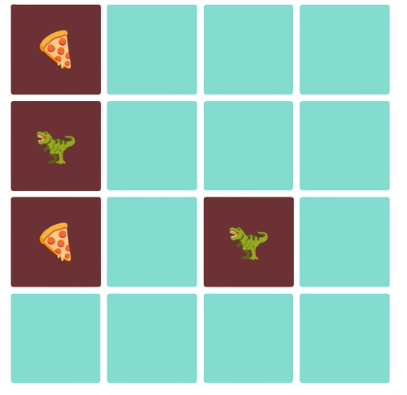

# Memory Game

**Un clasico juego de memoria utlizando React y Node**

**Cuenta con la versión estable de:**

- **Node**: 16.16.0
- **NPM**: 8.11.0

> **Importante:** Las dependencias actuales se encuentran en las siguientes versiones:

- **react**: 18.1.0
- **react-dom**: 18.1.0

## Enunciado

La idea general fue crear una aplicación en la cual se puedan jugar el clasico juego memorama (conocido por ese nombre en México)

- Buscar pokemons
- Filtrarlos / Ordenarlos
- Crear nuevos pokemons

#### Tecnologías ocupadas

- [ ] React
- [ ] NodeJS
- [ ] JavaScript
- [ ] HTML
- [ ] CSS

## Frontend

Se desarrollo una aplicación de React que contiene las siguientes pantallas/rutas.

**Ruta principal**

- [ ] Un tablero de 4x4 de cartas para voltera. Al recargar se revuelven las imganes aleatoriamente.
