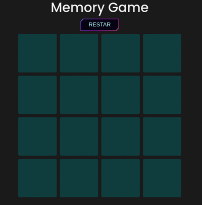

[🇲🇽-Español](../README.md)

<h1 align="center">Memory Game</h1>

<p align="center">
   
    
</p>


## Description 📋

Memory card game. The goal of this game is to find all pairs of cards to win. React is used for handling states. It has a button to restart the game. When winning, a winner message appears.

**Steps to run the project on your computer 🔧**

```txt
  1. Fork the repository
  2. Clone the repository to your local
  3. Install the dependencies with: npm install
  4. Run: npm start
```

> **_Important:_** Dependencies are in the following versions:

- **react**: 18.1.0
- **react-dom**: 18.1.0

## Technologies 🖥

- React
- JavaScript
- HTML
- CSS

## Do you want to contribute? 🤝

There is still a lot that can be done with this project. Here are some ideas if you want to contribute.

- **Point Counter**
- **Select the number of cards**
- **Change light/dark mode**

## Author

| [<br><sub>Emmanuel Arenas</sub>](https://github.com/EmmanuelArenas) |
| :--------------------------------------------------------------------------------------------------------------------------------------------------------------------------------------------: |

## License 📄

License: [MIT](License)

## Preview


